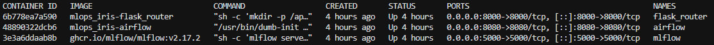
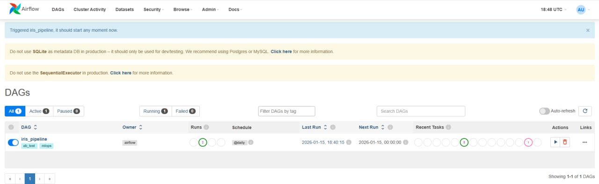
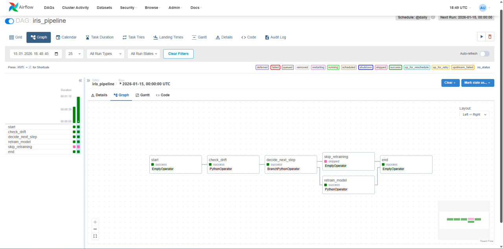
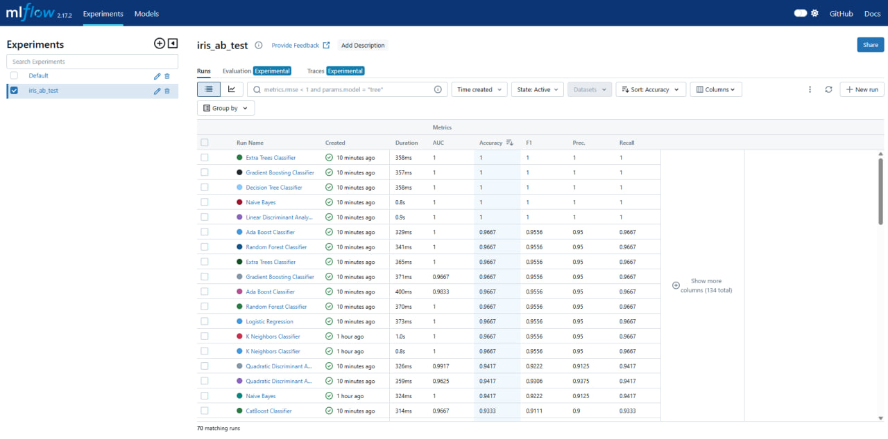
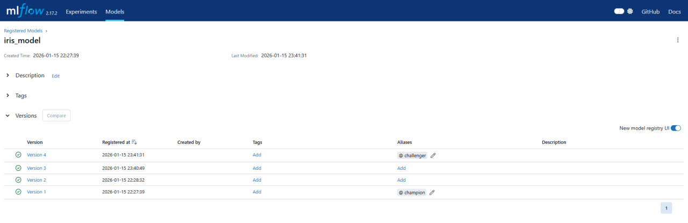
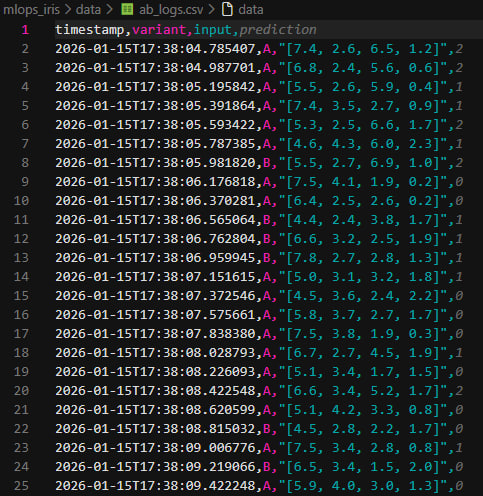
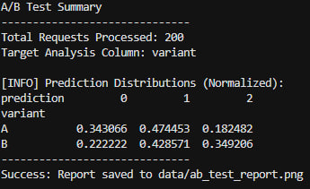
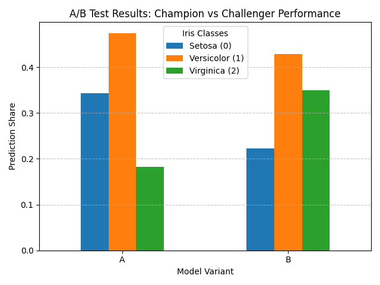

# ML-процесс от мониторинга до A/B  

В рамках выполненной работы были выполнены следующие пункты:  
- _Мониторинг дрифта данных_: автоматическая проверка статистического расхождения данных
- _Автоматическое переобучение_: пайплайн в Airflow запускает PyCaret (AutoML) для поиска лучшей модели при обнаружении дрифта
- _Регистрация модели_: использование MLflow для версионирования и управления статусами моделей
- _A/B тест_ с использованием Flask-роутера, распределяющего трафик между моделями
- _Формирование автоматического отчета_ по результатам экспериментов

## Процесс запуска  
1. Клонировать репозиторий
    ```bash
    git clone [https://github.com/gaguri/mlops_iris.git](https://github.com/gaguri/mlops_iris.git)
    cd mlops_iris
    ```
2. Запустить инфраструктуру
    ```bash
    docker-compose up -d --build
    ```
3. Имитировать нагрузку
    ```bash
    python test_api.py
    ```
    Также система поддерживает динамическое управление трафиком через API-метод '/set_traffic'
    Команда для изменения доли трафика (например, до 50% на модель B):
     ```bash
     curl -X POST http://localhost:8000/set_traffic \
       -H "Content-Type: application/json" \
       -d "{\"ratio\": 0.5}"
5. Сгенерировать отчет
   ```bash
   python analyze_ab_test.py
   ```

## Инфраструктура

*Список запущенных микросервисов в Docker*

   
## Визуализация

*Экран выполненного DAG*

*Граф логики*

*История запусков обучения и метрики*

*Версии модели с метками champion (A) и challenger (B)*

*Логи A/B теста*

*Консольный отчет по распределению предсказаний*

*Визуализация сравнения работы моделей*
